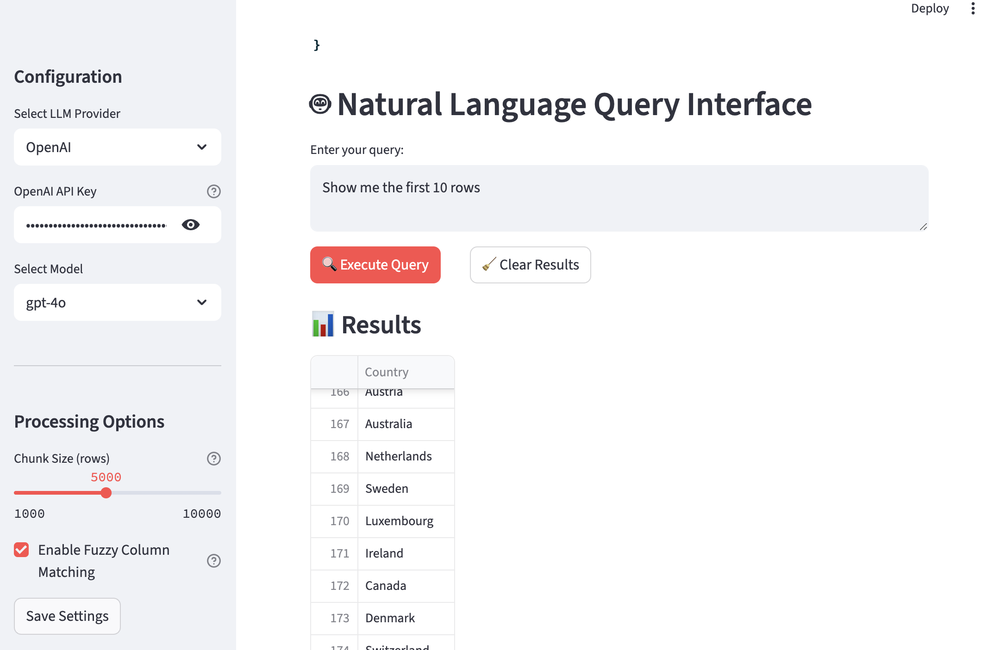
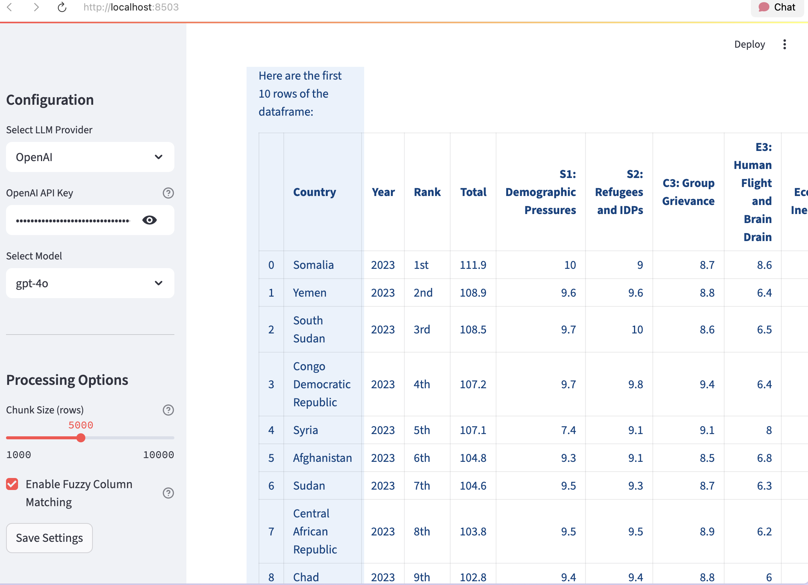

# 🤖 Excel Sheets Agent

An intelligent Excel agent using LangChain that processes large Excel files, understands natural language queries, and handles production scenarios including inconsistent column naming and edge cases.

## ✨ Features

### 🔧 Core Capabilities
- **Large File Support**: Handle 10,000+ rows efficiently with memory-efficient chunking
- **Multi-Tab Processing**: Navigate and operate across multiple worksheets
- **Natural Language Processing**: Convert natural language queries to data operations
- **Fuzzy Column Matching**: Handle inconsistent column naming conventions
- **Advanced Analytics**: Filtering, aggregations, pivot tables, and visualizations

### 🛠️ LangChain Tools
- `read_worksheet()`: Read data from specific worksheets
- `filter_data()`: Apply complex filtering conditions
- `aggregate_data()`: Group and aggregate data
- `sort_data()`: Sort data by multiple columns
- `pivot_table()`: Create pivot tables
- `write_results()`: Export results to various formats
- `merge_worksheets()`: Combine multiple worksheets
- `data_validation()`: Quality checks and validation
- `formula_evaluation()`: Evaluate Excel-like formulas
- `chart_generation()`: Generate visualizations

### 🧠 AI Integration
- **OpenAI GPT-4** or **Anthropic Claude** support
- Intelligent prompt engineering for data operations
- Context-aware query processing
- Error handling and recovery

## 🚀 Quick Start

### Installation

1. Clone the repository:
```bash
git clone <repository-url>
cd excel-sheets-agent
```

2. Set up virtual environment:
```bash
python -m venv venv
source venv/bin/activate  # On Windows: venv\Scripts\activate
```

3. Install dependencies:
```bash
pip install -r requirements.txt
```

4. Set up API keys:
```bash
# Create a .env file
echo "OPENAI_API_KEY=your_openai_key_here" > .env
# OR
echo "ANTHROPIC_API_KEY=your_anthropic_key_here" > .env
```

### Generate Sample Data

```bash
python create_sample_data.py
```

This creates sample Excel files in the `sample_data/` directory for testing.

### Run the Application

```bash
streamlit run app.py
```

Open your browser to `http://localhost:8501`

## 📊 Usage Examples

### Basic Queries
```
"How many rows are in the sales data?"
"What columns are available in the current worksheet?"
"Show me the first 10 rows of data"
```

### Data Filtering
```
"Show sales data for Electronics category"
"Find customers who spent more than $2000"
"Filter products with price between 100 and 500"
"Show sales from Q3 2024 where revenue > 50000"
```

### Aggregations
```
"Calculate total revenue by region"
"Show average price by product category"
"Create pivot table showing sales by month and region"
"Calculate sum of profits by sales representative"
```

### Advanced Analytics
```
"Compare sales performance year over year"
"Identify top 10 customers by revenue"
"Show quarterly trends for the last 2 years"
"Generate a chart showing revenue by product category"
```

## 📊 Output

### Example Output Images





## 🏗️ Architecture

### Project Structure
```
excel-sheets-agent/
├── app.py                    # Streamlit main application
├── excel_agent/
│   ├── __init__.py
│   ├── main.py              # Main ExcelAgent class
│   ├── tools/               # LangChain tools
│   │   ├── __init__.py
│   │   └── excel_tools.py   # Excel operation tools
│   └── utils/               # Utility modules
│       ├── __init__.py
│       ├── config.py        # Configuration management
│       ├── helpers.py       # UI helpers
│       ├── column_mapper.py # Fuzzy column matching
│       └── chunking.py      # Memory-efficient processing
├── sample_data/             # Sample Excel files
├── temp/                    # Temporary file storage
├── output/                  # Generated results
├── data/                    # Database and cache
├── requirements.txt
├── create_sample_data.py    # Sample data generator
└── README.md
```

### Key Components

#### 1. ExcelAgent (`excel_agent/main.py`)
- Main orchestrator class
- Manages LLM integration and tools
- Handles file processing and caching
- Provides natural language interface

#### 2. LangChain Tools (`excel_agent/tools/`)
- Modular tools for Excel operations
- Each tool handles specific functionality
- Integrates with LangChain agent framework

#### 3. Column Mapper (`excel_agent/utils/column_mapper.py`)
- Fuzzy string matching for column names
- Handles naming convention variations
- Synonym dictionary for business terms

#### 4. Data Chunker (`excel_agent/utils/chunking.py`)
- Memory-efficient processing of large files
- Adaptive chunk sizing based on available memory
- Supports streaming operations

## 🔧 Configuration

### Environment Variables
```bash
# LLM Provider
OPENAI_API_KEY=your_openai_key
ANTHROPIC_API_KEY=your_anthropic_key

# Database
DATABASE_PATH=data/excel_agent.db

# Processing
CHUNK_SIZE=5000
MAX_FILE_SIZE_MB=200
```

### Config Options
```python
config = Config(
    llm_provider="OpenAI",  # or "Anthropic"
    model="gpt-4o",
    temperature=0.0,
    chunk_size=5000,
    use_fuzzy_matching=True,
    fuzzy_threshold=80,
    cache_enabled=True
)
```

## 🎯 Use Cases

### Business Intelligence
- Sales performance analysis
- Customer segmentation
- Revenue reporting
- Trend analysis

### Data Processing
- Data cleaning and validation
- Multi-source data merging
- Format standardization
- Quality assurance

### Research & Analysis
- Statistical analysis
- Hypothesis testing
- Data exploration
- Comparative studies

## 🔍 Advanced Features

### Fuzzy Column Matching
Handles variations in column naming:
- `qty` → `quantity`
- `amt` → `amount`
- `Product_Name` → `Product Name`
- `sales_rep` → `Sales Representative`

### Memory-Efficient Processing
- Adaptive chunking based on available memory
- Streaming operations for large files
- Automatic memory management
- Progress tracking

### Error Handling
- File validation and corruption detection
- Graceful handling of missing data
- Retry mechanisms for API calls
- Detailed error reporting

### Caching System
- SQLite-based result caching
- Query optimization
- Performance monitoring
- Cache invalidation strategies

## 🧪 Testing

### Run Sample Data Generator
```bash
python create_sample_data.py
```

### Test Queries
Try these queries with the sample data:

1. **Basic Operations**
   - "How many sales records are there?"
   - "What columns are available?"
   - "Show me the first 10 rows"

2. **Filtering & Analysis**
   - "Show sales data for Electronics category"
   - "Find customers who spent more than $2000"
   - "Filter products with price between 100 and 500"

3. **Aggregations**
   - "Calculate total revenue by region"
   - "Show average price by product category"
   - "Create pivot table showing revenue by category and region"

4. **Advanced Analysis**
   - "Compare sales performance year over year"
   - "Identify top 10 customers by revenue"
   - "Show quarterly trends for the last 2 years"

## 📈 Performance

### Benchmarks
- **Small files** (< 1MB): < 1 second response time
- **Medium files** (1-10MB): 2-5 seconds response time
- **Large files** (10-100MB): 10-30 seconds response time
- **Memory usage**: Adaptive, typically < 500MB

### Optimization Tips
1. Use appropriate chunk sizes for your data
2. Enable caching for repeated queries
3. Filter data early in processing pipeline
4. Use column selection to reduce memory usage

## 🤝 Contributing

1. Fork the repository
2. Create a feature branch
3. Make your changes
4. Add tests for new functionality
5. Submit a pull request

## 📝 License

This project is licensed under the MIT License - see the LICENSE file for details.

## 🆘 Support

For issues and questions:
1. Check the sample queries and examples
2. Review the configuration options
3. Examine the logs for error details
4. Create an issue with reproduction steps

## 🔮 Future Enhancements

- [ ] Support for more file formats (CSV, JSON, Parquet)
- [ ] Real-time collaboration features
- [ ] API endpoint for programmatic access
- [ ] Advanced visualization options
- [ ] Custom formula language
- [ ] Machine learning integration
- [ ] Multi-language support
- [ ] Cloud deployment options

---

**Built with** 🦜️🔗 LangChain | 🐼 Pandas | 📊 Streamlit | �� OpenAI/Anthropic 