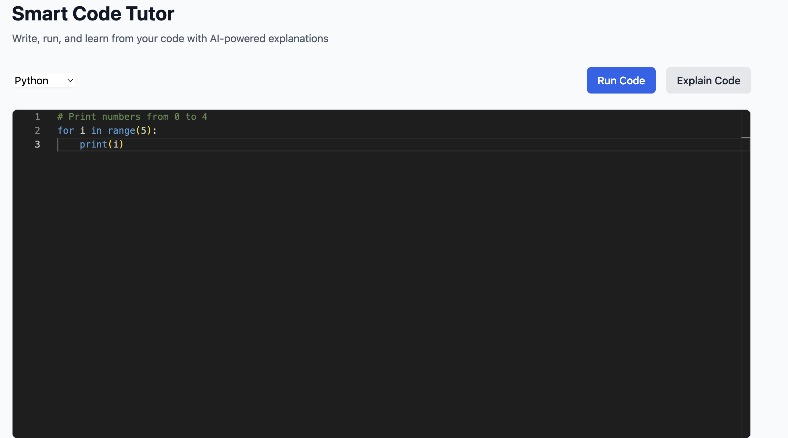
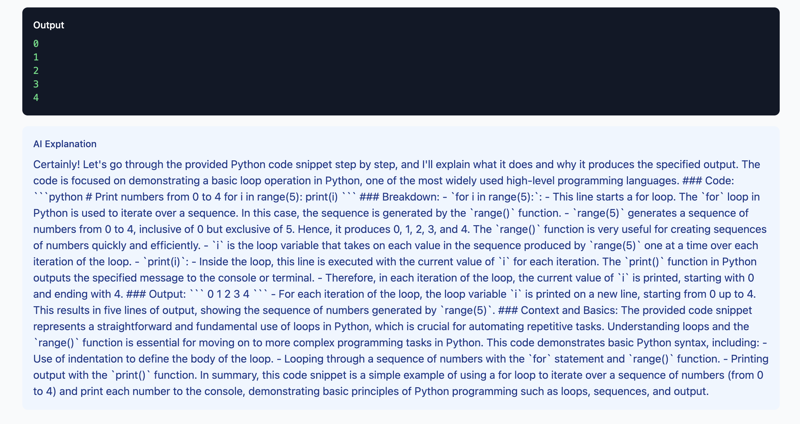

# Smart Code Tutor 🎓

A full-stack web application for interactive code execution and AI-powered explanations.

## 🌟 Features

- Real-time Python & JavaScript code execution in the browser
- Secure sandboxed environment using E2B
- Live streaming of execution results via WebSockets
- AI-powered code explanations using RAG (Retrieval Augmented Generation)
- Interactive code editor with syntax highlighting
- Support for concurrent user sessions

## 🏗️ Architecture

```
Smart Code Tutor/
├── frontend/          # React application with TailwindCSS
├── backend/           # FastAPI server with WebSocket support
├── rag/              # LangChain + FAISS for AI explanations
├── sandbox/          # E2B integration for code execution
└── docs/             # Documentation and architecture diagrams
```

## 🚀 Tech Stack

### Frontend
- React 18+
- TailwindCSS
- Monaco Editor
- WebSocket client
- TypeScript

### Backend
- FastAPI
- WebSockets
- E2B SDK
- AsyncIO

### RAG Pipeline
- LangChain
- FAISS Vector Store
- OpenAI Embeddings
- Technical documentation corpus

## 🛠️ Setup Instructions

### Prerequisites
- Node.js 18+
- Python 3.9+
- Docker & Docker Compose
- E2B API Key
- OpenAI API Key

### Output


*Main interface of Smart Code Tutor showing the code editor*


*Code execution output and AI explanation display*

### Development Setup

1. Clone the repository:
```bash
git clone <repository-url>
cd smart-code-tutor
```

2. Install dependencies:
```bash
# Frontend
cd frontend
npm install

# Backend
cd ../backend
python -m venv venv
source venv/bin/activate  # or `venv\Scripts\activate` on Windows
pip install -r requirements.txt
```

3. Set up environment variables:
```bash
# Frontend (.env)
VITE_API_URL=http://localhost:8000
VITE_WS_URL=ws://localhost:8000/ws

# Backend (.env)
E2B_API_KEY=your_e2b_key
OPENAI_API_KEY=your_openai_key
```

4. Start the development servers:
```bash
# Frontend
cd frontend
npm run dev

# Backend
cd ../backend
uvicorn main:app --reload
```

5. Access the application:
- Frontend: http://localhost:5173
- Backend API: http://localhost:8000
- API Documentation: http://localhost:8000/docs

## 📊 System Design

The application follows a microservices architecture with the following components:

1. **Frontend Service**
   - React SPA with real-time code editor
   - WebSocket client for live execution updates
   - Responsive UI with TailwindCSS
   - TypeScript for type safety

2. **Backend Service**
   - FastAPI server handling WebSocket connections
   - Session management for concurrent users
   - Integration with E2B sandbox
   - API endpoints for code execution and explanations

3. **RAG Service**
   - Document ingestion pipeline
   - Vector similarity search using FAISS
   - LangChain for context-aware responses
   - Technical documentation corpus

4. **Sandbox Service**
   - E2B integration for secure code execution
   - Isolated environments per user
   - Resource usage monitoring
   - Execution timeout handling

## 🔒 Security Considerations

- Sandboxed code execution using E2B
- Rate limiting on API endpoints
- Input validation and sanitization
- Secure WebSocket connections
- Environment variable protection

## 📈 Monitoring & Observability

- Execution metrics tracking
- Response time monitoring
- Error rate tracking
- Resource usage monitoring

## 🤝 Contributing

Please read [CONTRIBUTING.md](CONTRIBUTING.md) for details on our code of conduct and the process for submitting pull requests.

## 📝 License

This project is licensed under the MIT License - see the [LICENSE](LICENSE) file for details.