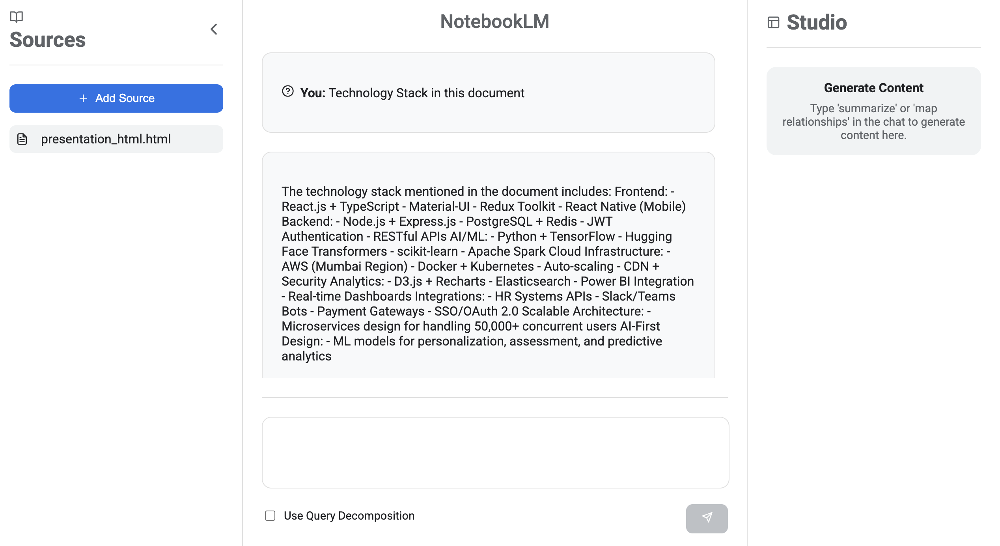

# NotebookLM: Your Intelligent Research Assistant



NotebookLM is a sophisticated, AI-powered research and writing assistant designed to help you connect ideas, generate content, and accelerate your workflows. By grounding itself in your trusted documents, NotebookLM provides a personalized and contextually aware AI experience.

## 🚀 Key Features

- **📝 Multi-Format Document Processing**: Seamlessly upload and process a wide variety of document formats, including PDFs, DOCX, PPTX, XLSX, HTML, and more.
- **🖼️ Multimodal Analysis**: Go beyond text with the ability to analyze and understand images embedded within your documents using state-of-the-art vision models.
- **🧠 Advanced RAG Pipeline**: Leverage a powerful Retrieval-Augmented Generation (RAG) pipeline with a hybrid search mechanism that combines semantic (ChromaDB) and keyword-based (BM25) retrieval for highly relevant and accurate answers.
- **🔍 Query Decomposition**: Ask complex, multi-part questions. The system will intelligently break them down into smaller sub-queries, execute them, and synthesize a comprehensive final answer.
- **📊 Relationship Mapping**: Automatically extract key entities and their relationships from your documents and visualize them as an interactive graph.
- **✍️ Smart Summarization**: Generate concise, executive-level summaries from single or multiple documents with a single command.
- **✨ Modern, Interactive UI**: A sleek, futuristic user interface inspired by Google's NotebookLM, built with React and designed for an intuitive and engaging user experience.

## 🛠️ Tech Stack

- **Frontend**: React, Vite, Axios, React-Icons, `react-graph-vis`
- **Backend**: Python, FastAPI, LangChain, OpenAI, ChromaDB, `rank-bm25`, `unstructured`
- **Deployment**: The application is designed to be run locally, with the frontend and backend servers running in parallel.

## 📂 Project Structure

```
notebook/
├── Backend/
│   ├── app/
│   │   ├── __init__.py
│   │   ├── main.py
│   │   ├── rag_pipeline.py
│   │   ├── document_processor.py
│   │   ├── vision_analyzer.py
│   │   ├── query_decomposition_agent.py
│   │   ├── summarization_agent.py
│   │   └── relationship_mapping_agent.py
│   └── uploads/
├── Frontend/
│   ├── src/
│   │   ├── components/
│   │   │   ├── GraphVisualization.jsx
│   │   │   ├── QueryResult.jsx
│   │   │   └── DecomposedQueryResult.jsx
│   │   ├── App.css
│   │   └── App.jsx
│   └── vite.config.js
└── README.md
```

## ⚙️ Setup and Installation

### Prerequisites

- Python 3.9+
- Node.js 16+
- An OpenAI API key

### Backend Setup

1.  **Create and activate a virtual environment**:
    ```bash
    python -m venv venv
    source venv/bin/activate  # On Windows: venv\Scripts\activate
    ```
2.  **Install dependencies**:
    ```bash
    pip install -r requirements.txt
    ```
3.  **Set up your environment variables**: Create a `.env` file in the `Backend` directory and add your OpenAI API key:
    ```
    OPENAI_API_KEY="your-api-key-here"
    ```
4.  **Run the backend server**:
    ```bash
    cd Backend
    uvicorn app.main:app --host 0.0.0.0 --port 8000 --reload
    ```

### Frontend Setup

1.  **Install dependencies**:
    ```bash
    cd Frontend
    npm install
    ```
2.  **Run the development server**:
    ```bash
    npm run dev
    ```

## ใช้งาน (Usage)

1.  **Access the application**: Open your browser and navigate to `http://localhost:5173`.
2.  **Upload documents**: Click the "+ Add Source" button to upload your documents.
3.  **Interact with the chat**: Ask questions, or type "summarize" or "map relationships" to interact with your documents.

## License

This project is licensed under the MIT License. 